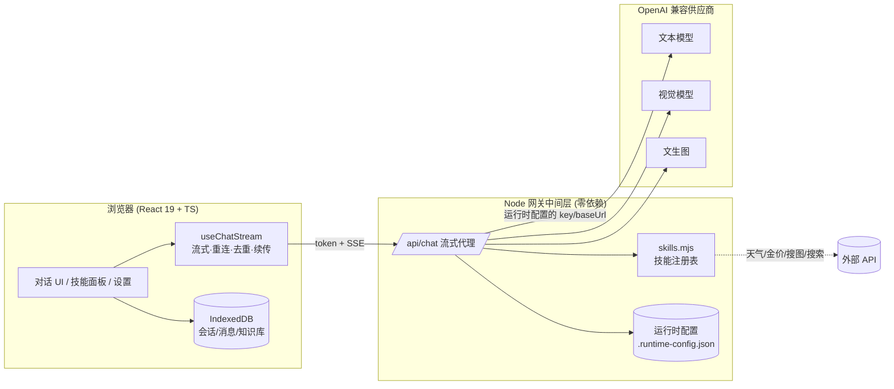

# 流式 AI 对话平台（Streaming AI Chat）

一个**可配置供应商、可配置技能**的全栈 AI 对话应用：流式渲染、断线重连、工具调用 Agent、RAG 知识库、多模态（看图/生图/搜图）、语音、模型网关中间层。前端纯手写，后端是一层零依赖的 OpenAI 兼容代理。

> 接入任意 OpenAI 兼容大模型（智谱 / DeepSeek / 通义千问 / Ollama / Groq …），界面上点选即可切换，无需改代码。

---

## ✨ 功能特性

**对话核心**
- 流式渲染（fetch + ReadableStream 读 SSE，逐字打字机）、可中断
- **断线自动重连 + 消息去重 + 顺序保证**（seq 排序、id 去重、afterSeq 续传）
- **暂停续传**、**就地编辑重答**、**重新生成**
- 多会话历史（IndexedDB 持久化）、模型自动生成标题、搜索/重命名/删除会话
- Markdown + 代码高亮、消息/代码一键复制、导出对话为 Markdown

**AI / Agent**
- **工具调用（Function Calling）Agent**：统一技能注册表，6+ 技能（时间/天气/金价/计算/搜图/生图/联网搜索）
- **工具调用步骤时间线**（各步耗时可视化）、技能面板（可视化启用/禁用）
- **RAG 知识库**：文档切块 → 关键词检索 → 注入上下文 → 引用标注
- **多模态**：看图（视觉模型）、AI 生图、网络搜真实图，按意图自动路由
- **多轮上下文**、**语音输入 + 朗读**（Web Speech API）

**工程 / 平台**
- **模型网关中间层**：运行时可视化配置供应商/密钥/模型，热更新 + 持久化，密钥不落前端
- 登录鉴权（token + 401 并发守卫 + lossless-json 大整数）
- 虚拟滚动（长列表只渲染可视区）、代码分割、React Compiler、版本自愈、全局 ErrorBoundary
- i18n 中英双语、明暗主题、命令式弹窗、单元测试（Vitest）、Docker 一键部署

---

## 🏗 架构



**关键点**：后端把多家 LLM 抽象成统一 OpenAI 兼容接口；技能集中在 `skills.mjs` 注册表，自动派生工具列表与分发；前端通过网关代理调用，密钥不暴露在前端代码里。

---

## 🚀 快速开始

```bash
npm install
npm run dev        # 同时启动后端(8787) + 前端(5173)
```
打开 http://localhost:5173 → 登录（任意账号密码）→ 点 **⚙️** 选供应商、填 API Key（推荐免费的**智谱 GLM**）→ 开聊。

也可用 `.env` 配置（`cp .env.example .env`）。

## 🧪 测试

```bash
npm test           # Vitest：SSE 解析 / RAG 检索打分等纯逻辑单测
```

## 🐳 生产部署（Docker）

```bash
echo "LLM_API_KEY=你的key" > .env
docker compose up -d   # 构建前端 + 一个容器全栈托管，访问 http://localhost:8787
```
> 生产模式下 Node 服务同时托管前端静态资源与 API，单进程即可。

---

## 📁 项目结构

```
server.mjs            # Node 网关：流式代理 / 鉴权 / 配置 / 静态托管
skills.mjs            # 技能注册表（加功能只改这里）
src/
  App.tsx             # 主应用
  useChatStream.ts    # 流式核心：重连/去重/续传/暂停
  useVoice.ts         # 语音输入/朗读
  MarkdownRenderer.tsx# Markdown + 高亮 + 代码复制
  SettingsModal/SkillsModal/KnowledgeModal ...
  lib/
    request.ts        # axios 封装（拦截器/401守卫/lossless-json）
    auth.ts rag.ts ragCore.ts sse.ts db.ts ...
```

## 🛠 技术栈

React 19 · TypeScript · Vite · @tanstack/react-virtual · react-markdown · idb · i18next · axios · lossless-json · Vitest · Node(http) · Docker

---

## 💬 简历一句话

> 独立开发可配置的全栈 AI 对话平台：自研流式传输层（断线重连/去重/续传）、注册式工具调用 Agent 与技能面板、RAG 知识库、多模态（图文/语音）、模型网关中间层（运行时切换供应商），并完成虚拟滚动/代码分割等性能优化、单测与 Docker 部署。
